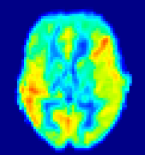
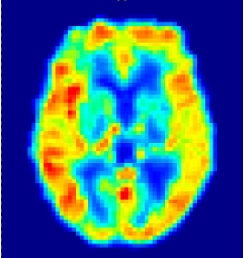

# AgGAN: Anatomy-Guided Generative Adversarial Network to Synthesize Arterial Spin Labeling Images under Simulated Microgravity <br>

## :computer: Dataset<br>
### :hospital: Study protocol 
A -6° head down tilt bed rest (HDTBR) model was utilized as simulated microgravity analogue.<br> 
The data collected in baseline and after 7-day HDTBR (BR7). Please note that the -6° HDT position was still maintained during the ASL image acquisition when completed 7-day HDTBR.


### :tv: Preview
<p align="center">
  <figure style="display: inline-block; margin: 0 10px; text-align: center; width: 25%;">
    
    <figcaption>ASL image in Baseline</figcaption>
  </figure>
  <figure style="display: inline-block; margin: 0 10px; text-align: center; width: 25%;">
    
    <figcaption>ASL image in BR7</figcaption>
  </figure>
</p>

### :bookmark: Details
**MRI device:** 3.0-T scanner (Siemens Magnetom Vida, Erlangen, Germany) with 64-channel head coil<br>
**Scan sequence:** Brain 3-dimensional pseudo-continuous arterial spin labeling (3D pcASL) <br>
**Scan parameters:** TR=4170 ms, TE 40.6 ms, FOV = 224 × 224 mm2, matrix size = 64 × 64, voxel size = 3.5 × 3.5 × 3.5 mm3, 32 slices, post-labeling delay = 500, 1000, 1500, 2000 and 2500 ms. Multi- delay ASL image postprocessing was performed using Anying CereFlow software (Anying Technology Beijing Co, Ltd) and obtained corrected ASL image.

### :outbox_tray: Download
Examples of ASL images in Baseline and BR7:<br> 
<p align = center> 
  <a href="https://drive.google.com/drive/folders/1gtwf1kw6yeX9d-4xx5shDxvqOTwJAlD-?usp=sharing">
     
  </a>
  <a href="https://pan.baidu.com/s/15N5lWcD8l0mkwiCR_K3Eaw?pwd=y2gs">
    
  </a>
</p> 
Plaese note these examples are original data after anonymization and without any preprocessing. <br>Completed dataset release is undergoing ethical approval.

## :rocket: Usage<br>
### Requirmenets
```
Python==3.8
Pytorch==1.13.1
numpy==1.24.4
scikit-learn==1.2.2
scipy==1.11.4
```
### Data Preprocessing
The volume data need to be cropped or resized to 64*64, and intensity value need to be scaled to [-1,1]. More details can be found at
```
python data/preprocess.py
```
### Comparison algorithm
* [FCN](https://github.com/CV-Reimplementation/medSynth-Reimplementation)
* [U-Net](https://github.com/wajahat-alikhan/3d-UNet)
* [Pix2Pix](https://github.com/junyanz/pytorch-CycleGAN-and-pix2pix)
* [MS](https://github.com/Newmu/dcgan_code)


### Train
```
./scripts/train_asl.sh -n pp_full_ex01 -m pp_full
# or
python train.py -n pp_full_ex01 -m pp_full -xx ...
```
## :pushpin: Citation
If you found this work useful for you, please consider citing it.
```
@article{AgGAN 
  title   = {AgGAN:Anatomy-Guided Generative Adversarial Network to Synthesize Arterial Spin Labeling Images under Simulated Microgravity},
  author  = {###},
  journal = {####},
  year    = {####}
}
```
## :mailbox: Contact
For any issues/questions regarding the paper or reproducing the results, please contact any of the following.

##: ###

School of Biological Science and Medical Engineering, Beihang University, 37 Xueyuan Road, Beijing, 100853

